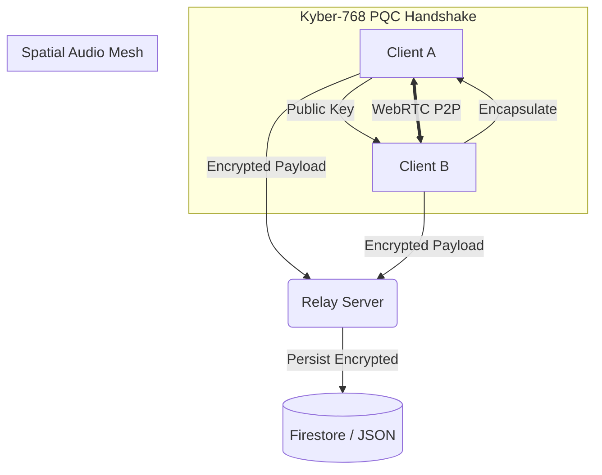

# AES Chat
### Quantum-Resistant, High-Fidelity End-to-End Encrypted Real-Time Communication Platform

  

**AES Chat** is a high-security, browser-native communication platform designed for the post-quantum era. It establishes a sovereign digital territory by combining military-grade symmetric encryption (AES-256-GCM) with cutting-edge lattice-based asymmetric cryptography (Crystals-Kyber-768).

---

## 1. Abstract

The platform addresses the "Harvest Now, Decrypt Later" threat posed by emerging Quantum Computing. By utilizing **NIST-standard Post-Quantum Cryptography (PQC)**, AES Chat ensures that even if encrypted traffic is captured today, it remains mathematically inaccessible to future quantum adversaries. Beyond security, the platform introduces **Spatial Computing** for collaborative voice and an **Infinite Encrypted Canvas**, redefining the ergonomics of digital interaction.

---

## 2. Revolutionary Features

### 🛡️ Post-Quantum Security (PQC)
*   **Kyber-768 Handshake**: Replaces vulnerable RSA/ECDH with a Module-Lattice-based Key Encapsulation Mechanism (KEM). 
*   **Ephemeral Session Keys**: Random 256-bit AES keys are generated per session and never stored on disk, ensuring Perfect Forward Secrecy.
*   **E2EE Everything**: Every message, drawing stroke, and voice packet is encrypted client-side using the PQC-exchanged key.

### 🎧 Holo-Spatial Voice Rooms
*   **3D Audio Radar**: A visual radar UI allows users to position themselves and others in a virtual 3D space.
*   **The Cocktail Party Effect**: Spatial audio separation allows participants to understand multiple simultaneous speakers by positioning them in the stereo field (Left/Right/Near/Far).
*   **P2P WebRTC Mesh**: Audio streams bypass the server entirely, flowing directly between peer-encrypted nodes.

### ♾️ Infinite Canvas Collaboration
*   **End-to-End Encrypted Whiteboard**: A vector-based canvas where all drawing data is encrypted before transmission.
*   **Infinite Panning & Zoom**: No boundaries; designed for complex schematic brainstorming and mind-mapping.
*   **Vector Fidelity**: High-precision strokes with adjustable tools, colors, and global state sync.

### ⚡ Core Messenger Capabilities
*   **Self-Destruct (Disappearing Messages)**: Configurable timers from 5 seconds to 24 hours.
*   **Advanced Reactions**: Quick-tap emoji reactions synced across all participants.
*   **Live Code Highlighting**: Automatic detection and formatting of code snippets for developers.
*   **File & Media Exchange**: Encrypted blob transfer for images, videos, and documents.
*   **Dark-Mode Ergonomics**: A high-contrast, cyberpunk-inspired UI designed for long-session comfort.

---

## 3. Computational Security Analysis

### Brute Force Difficulty (AES-256)
The security of the symmetric layer is based on a 256-bit key length. The number of possible keys is $2^{256}$, which is approximately $1.15 \times 10^{77}$.

**The Calculation**:
*   **Global Computing Power**: Estimated at $10^{20}$ FLOPS (Floating Point Operations Per Second).
*   **Time to Crack**: $10^{77}$ keys / $10^{20}$ ops/sec = $10^{57}$ seconds.
*   **In Years**: $1.15 \times 10^{57} / (3.15 \times 10^7) \approx 3.67 \times 10^{49}$ years.

Given that the age of the universe is approximately $1.38 \times 10^{10}$ years, the time required to brute-force a single session key exceeds the **remaining life of the universe by a factor of trillions**.

### Quantum Resistance (Kyber-768)
Kyber-768 provides a security level equivalent to AES-192/256 against quantum attacks. By utilizing Module Learning with Errors (M-LWE) problems, it remains secure even as Grover's and Shor's algorithms render classical RSA/ECC obsolete.

---

## 4. Technical Architecture



### Technology Stack
*   **Frontend**: Vanilla JavaScript (ES6 Modules Core), HTML5, CSS3 (Custom Design System).
*   **Cryptography**: `crystals-kyber` (WASM/JS), Web Crypto API (SubtleCrypto).
*   **Real-time**: Socket.IO for signaling and message relay.
*   **Audio Engine**: Web Audio API with Spatial Panner Nodes.
*   **Networking**: WebRTC Data Channels and Media Streams for P2P Mesh.
*   **Persistence**: Node.js, Express, and Google Firestore (Production) / Local JSON (Dev).

---

## 5. Development & Deployment

### Prerequisites
*   Node.js (v18+)
*   NPM or Yarn

### Installation
1. Clone the repository:
   ```bash
   git clone https://github.com/triunex/aes-chat.git
   ```
2. Install dependencies:
   ```bash
   npm install
   ```
3. Start the development server:
   ```bash
   npm run dev
   ```

### Deployment
The platform is optimized for **Render**, **Vercel**, or **Docker** environments.
*   Set `NODE_ENV=production` for Firestore integration.
*   Ensure WebRTC STUN/TURN servers are configured for restrictive NAT environments.

---

## 6. Interface Design

*Figure 1: High-contrast, futuristic interface featuring the Holo-Space Radar and Infinite Canvas tools.*

---

## 7. License
MIT License - Developed for high-stakes secure communication.
